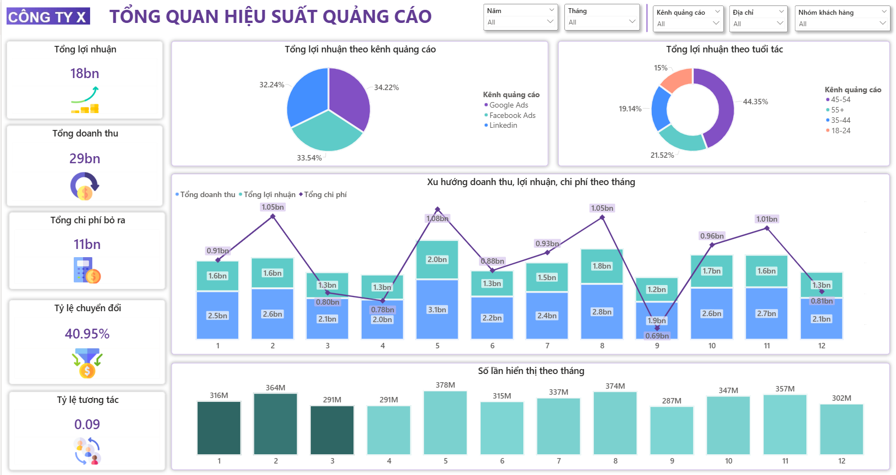
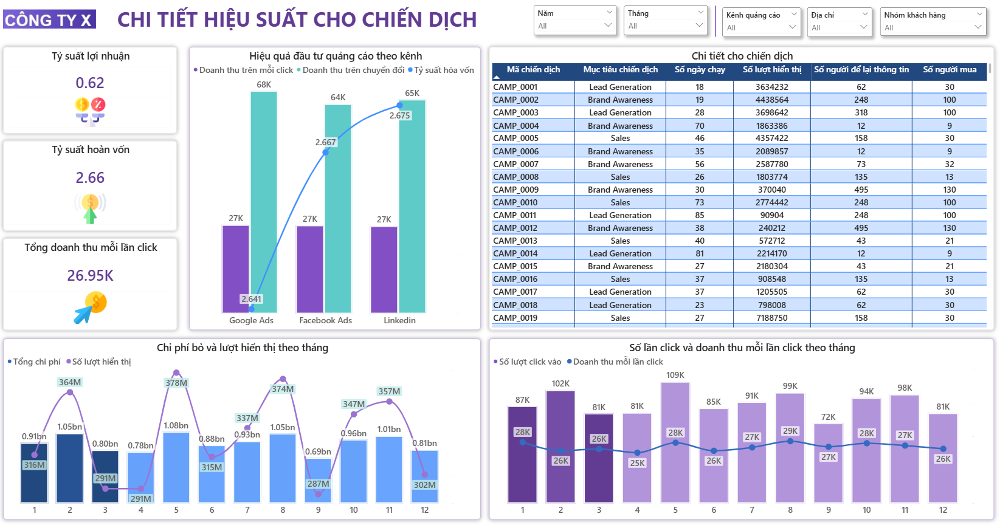
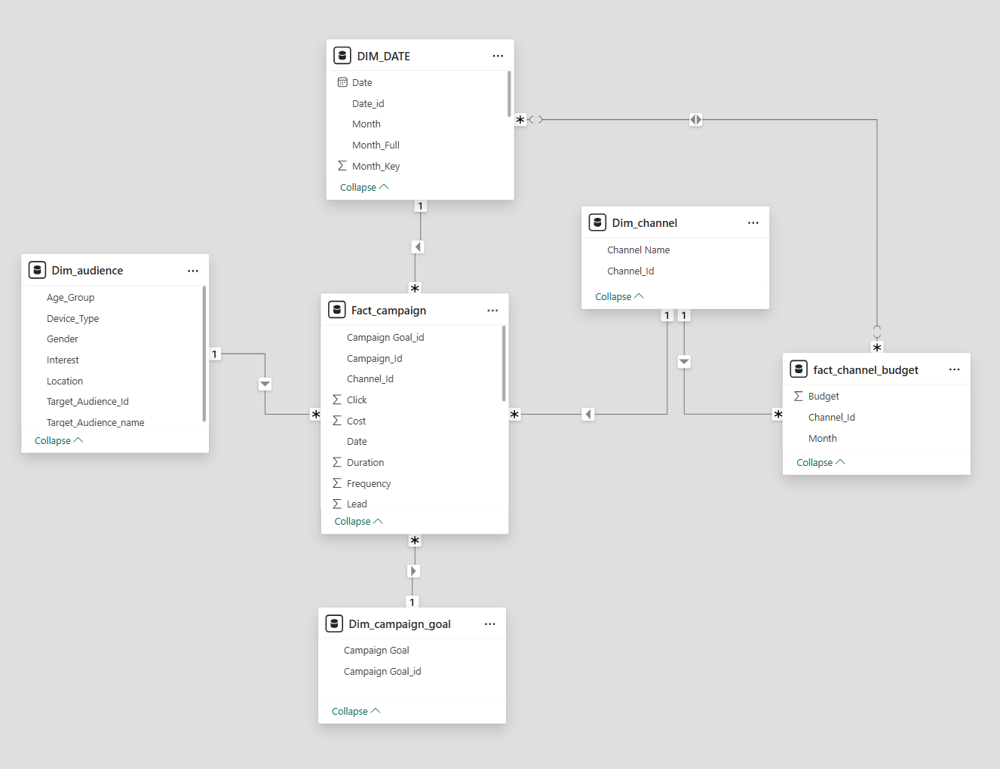

#  Advertising Campaign Performance Analysis

This project also includes a Power BI dashboard to analyze advertising campaign performance across different marketing channels such as Google Ads, Facebook Ads, and LinkedIn.

The dashboard helps monitor:
- Revenue
- Cost
- Profit
- Conversion rate
- Engagement rate
- Campaign performance by channel, month, age group, and customer segment

---

#  Dashboard Preview

## Advertising Performance Overview



---

## Campaign Performance Detail



---

#  Data Model: Fact and Dimension Tables

The raw advertising dataset is transformed into a structured **Star Schema Data Model** to support Power BI reporting.

## Data Model Preview



The model includes:

- **Fact_campaign**: stores campaign performance metrics such as revenue, cost, click, reach, lead, duration, and frequency.
- **fact_channel_budget**: stores monthly advertising budget by channel.
- **DIM_DATE**: stores date and month information.
- **Dim_channel**: stores advertising channel information.
- **Dim_audience**: stores audience information such as age group, gender, location, device type, and interest.
- **Dim_campaign_goal**: stores campaign goal information such as Sales, Brand Awareness, or Lead Generation.

---

#  Raw Data Processing

The raw advertising data is cleaned and transformed into fact and dimension tables before being loaded into Power BI.

Main processing steps:

1. Clean raw campaign data
2. Standardize date, month, channel, and audience fields
3. Create dimension tables for date, channel, audience, and campaign goal
4. Create fact tables for campaign performance and channel budget
5. Build relationships between fact and dimension tables
6. Load the final model into Power BI for dashboard visualization

---

#  DAX Measures

## Conversion Rate

```DAX
Conversion Rate =
DIVIDE(
    SUM(Fact_campaign[Lead]),
    SUM(Fact_campaign[Click])
)
```

## CTR / Revenue per Click

```DAX
CTR =
DIVIDE(
    SUM(Fact_campaign[Revenue]),
    SUM(Fact_campaign[Click])
)
```

## Engagement Rate

```DAX
Engagement Rate =
DIVIDE(
    SUM(Fact_campaign[Click]),
    SUM(Fact_campaign[Reach])
)
```

## Impression

```DAX
Impression =
SUMX(
    Fact_campaign,
    Fact_campaign[Reach] * Fact_campaign[Frequency]
)
```

## Profit Margin %

```DAX
Profit Margin % =
DIVIDE(
    [Total Profit],
    SUM(Fact_campaign[Revenue])
)
```

---

# Dashboard Features

## Overview Page

The overview dashboard shows:

- Total profit
- Total revenue
- Total advertising cost
- Conversion rate
- Engagement rate
- Profit by advertising channel
- Profit by age group
- Monthly trend of revenue, profit, and cost
- Monthly impressions

---

## Campaign Detail Page

The campaign detail dashboard shows:

- Profit margin
- Return on investment
- Revenue per click
- Channel performance
- Campaign-level details
- Monthly cost and impressions
- Monthly clicks and revenue per click

---

# Business Insights

This dashboard supports:

- Evaluating advertising channel effectiveness
- Comparing campaign performance by audience group
- Monitoring monthly marketing trends
- Identifying high-performing campaigns
- Optimizing advertising budget allocation
- Supporting data-driven marketing decisions

---
