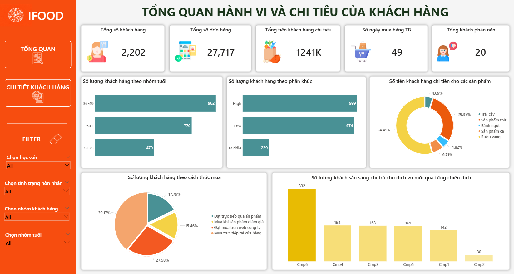
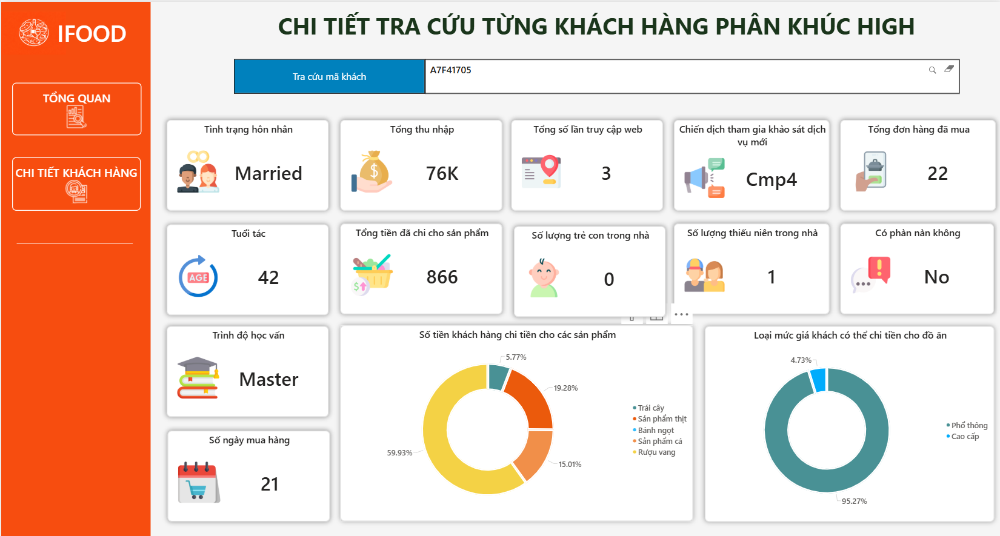

# Customer Behavior Analytics Dashboard

This project also includes a Power BI dashboard for analyzing customer purchasing behavior, customer segmentation, and campaign performance in the food delivery industry.

The dashboard helps businesses:
- Understand customer behavior patterns
- Analyze purchasing trends
- Identify high-value customers
- Support personalized marketing campaigns
- Monitor campaign effectiveness

---

# Dashboard Preview

## Customer Behavior Overview Dashboard



---

## Customer Detail Lookup Dashboard



---

#  RFM Analysis Model

The dashboard applies the **RFM Model**:

- **R (Recency)** → How recently customers made purchases
- **F (Frequency)** → How often customers purchase
- **M (Monetary)** → How much customers spend

The RFM model is used to classify customers into:
- High-value customers
- Medium-value customers
- Low-value customers

---

# RFM DAX Calculations

## Frequency Score

```DAX
F_score = 
VAR TotalPurchase = 'Customer behavior'[MntTotal]
VAR P33 = PERCENTILEX.INC(
    ALL('Customer behavior'),
    'Customer behavior'[MntTotal],
    0.33
)
VAR P66 = PERCENTILEX.INC(
    ALL('Customer behavior'),
    'Customer behavior'[MntTotal],
    0.66
)
RETURN 
    SWITCH(
        TRUE(),
        TotalPurchase > P66, 30,
        TotalPurchase > P33, 20,
        10
    )
```

---

## Monetary Score

```DAX
M_score = 
VAR MntTotal = 'Customer behavior'[MntTotal]
VAR P33 = PERCENTILEX.INC(
    ALL('Customer behavior'),
    'Customer behavior'[MntTotal],
    0.33
)
VAR P66 = PERCENTILEX.INC(
    ALL('Customer behavior'),
    'Customer behavior'[MntTotal],
    0.66
)
RETURN 
    SWITCH(
        TRUE(),
        MntTotal > P66, 30,
        MntTotal > P33, 20,
        10
    )
```

---

## Recency Score

```DAX
R_score = 
VAR Recency33 = 
    PERCENTILE.EXC('Customer behavior'[Recency], 0.33)

VAR Recency66 = 
    PERCENTILE.EXC('Customer behavior'[Recency], 0.66)

RETURN
    IF(
        'Customer behavior'[Recency] > Recency66, 
        10, 
        IF(
            'Customer behavior'[Recency] > Recency33, 
            20, 
            30
        )
    )
```

---

## Final RFM Score

```DAX
RFM_score = 
(
    'Customer behavior'[R_score] +
    'Customer behavior'[F_score] +
    'Customer behavior'[M_score]
) / 3
```

---

## RFM Segment Classification

```DAX
RFM_Segment = 
VAR Score =[RFM_score]

RETURN
SWITCH(
    TRUE(),
    Score <= 16.67, "Low",
    Score <= 23.33, "Middle",
    Score <= 30, "High",
    "Others"
)
```

---

# Age Group Classification

The dashboard also groups customers by age category:

```DAX
Nhóm tuổi = 
SWITCH(
    TRUE(),
    'Customer profile'[Age] >= 18 &&
    'Customer profile'[Age] <= 35, "18-35",

    'Customer profile'[Age] >= 36 &&
    'Customer profile'[Age] <= 49, "36-49",

    'Customer profile'[Age] >= 50, "50+",

    "Không xác định"
)
```

---

# Dashboard Features

## Customer Overview Dashboard

The overview dashboard includes:
- Total customers
- Total orders
- Total customer spending
- Average shopping days
- Total customer complaints
- Customer segmentation distribution
- Product spending analysis
- Campaign participation analysis

---

## Customer Detail Dashboard

The customer lookup dashboard allows:
- Customer ID search
- Customer profile lookup
- Spending analysis
- Campaign participation tracking
- Income and demographic analysis
- Product category spending analysis

---

# Business Intelligence Insights

The dashboard supports:
- Customer segmentation analysis
- Personalized campaign targeting
- Customer value analysis
- Behavioral trend analysis
- Marketing optimization
- Campaign performance tracking
- Customer retention strategy

---

# Power BI Data Modeling

The dashboard is built using:
- Star Schema Data Model
- Fact and Dimension Tables
- DAX Calculations
- Interactive Filters and Slicers
- KPI Cards and Visual Analytics

---
