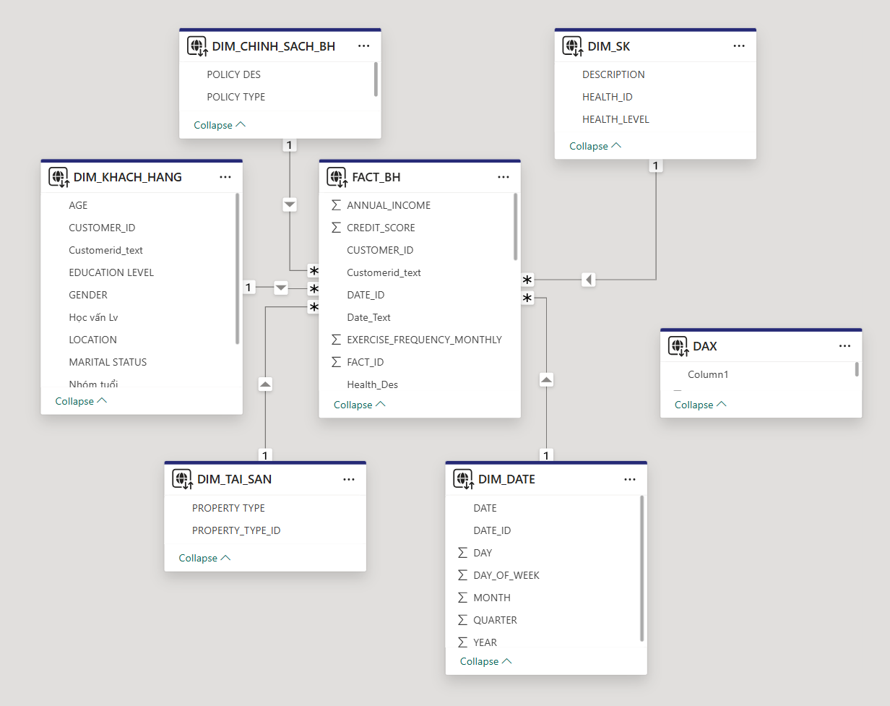
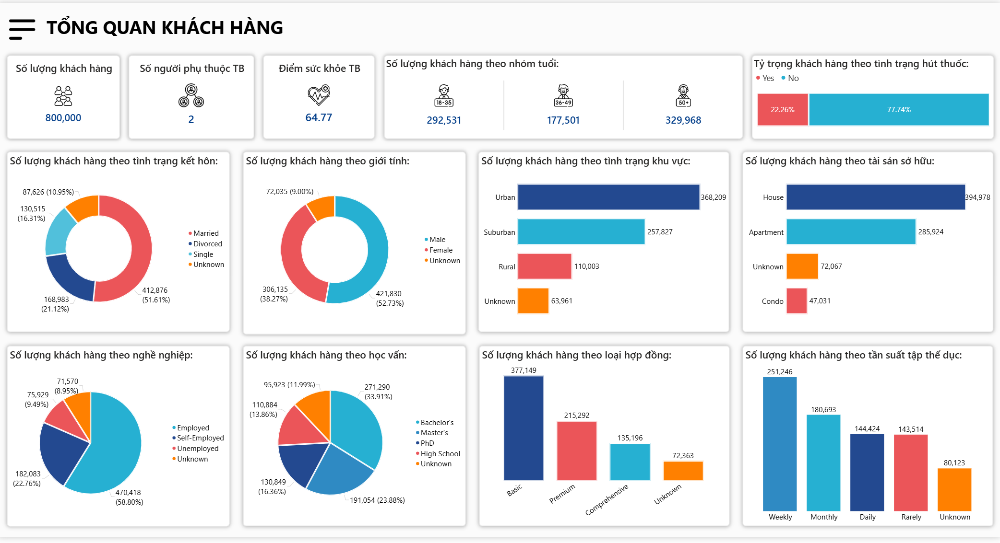
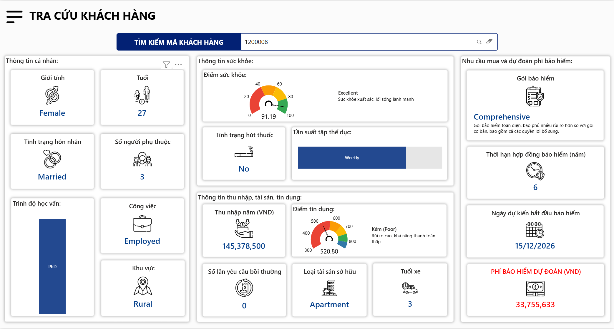

#  Insurance Premium Prediction
# Insurance Premium Prediction and Dashboard

## 1. Project Overview
This project focuses on building a machine learning model to predict insurance premiums based on customer characteristics. In addition, a Power BI dashboard is developed to visualize the data and support business analysis.

The project combines data analysis, predictive modeling, and visualization to provide both technical results and practical insights.

---

## 2. Objectives
- Analyze customer insurance data  
- Identify key factors affecting insurance premiums  
- Build a predictive model for premium estimation  
- Evaluate model performance  
- Develop a dashboard for visualization and insights  

---

## 3. Project Structure
project/ \
├── Mô_hình_dự_đoán_phí_BH.ipynb # Main notebook (EDA + Modeling)\
├── Insurance_predict_report.pbix # Power BI dashboard\
├── dataset/\
├── images/ # Images used in README\
└── README.md

---

## 4. Dataset Description
The dataset contains customer-related information used to predict insurance premiums.

### Key features:
- Age  
- Gender  
- BMI  
- Smoking status  
- Region  
- Premium Amount (target variable)  

---

## 5. Methodology

### 5.1 Data Loading
- Load dataset from source  
- Check dataset dimensions and structure  

---

### 5.2 Exploratory Data Analysis (EDA)

#### Data Overview
- Inspect data types  
- Summary statistics  

#### Missing Values
- Identify missing data  
- Handle missing values if necessary  

#### Data Distribution
- Analyze distribution of target variable  
- Explore relationships between features and target  

---

### 5.3 Feature Engineering
- Handle missing values  
- Encode categorical variables  
- Normalize or scale data if needed  

---

### 5.4 Modeling

Model used:
- XGBoost Regressor  

Reason:
- Handles non-linear relationships effectively  
- High performance on structured data  
- Robust to different data distributions  

---

### 5.5 Model Evaluation
- Cross-validation using K-Fold  
- Metrics:
  - RMSE (Root Mean Squared Error)  
  - MAE (Mean Absolute Error, if applicable)  

---
## 6. Data Model (Power BI)



### Overview
The data model follows a **star schema design**, where the central fact table is connected to multiple dimension tables.

### Fact Table
- **FACT_BH**
  - Contains main transactional data:
    - Annual Income  
    - Credit Score  
    - Exercise Frequency  
    - Customer ID  
    - Date ID  
  - This table is used for analysis and model prediction.

### Dimension Tables

- **DIM_KHACH_HANG (Customer)**
  - Customer attributes: Age, Gender, Education, Marital Status, Location  

- **DIM_DATE (Time)**
  - Date hierarchy: Day, Month, Quarter, Year  

- **DIM_TAI_SAN (Property)**
  - Property ownership type (House, Apartment, etc.)  

- **DIM_SK (Health)**
  - Health level classification and description  

- **DIM_CHINH_SACH_BH (Policy)**
  - Insurance policy type and description  

---

### Relationships
- One-to-many relationships from dimension tables to FACT_BH  
- FACT_BH acts as the central table for all analysis  
- Relationships are built on:
  - Customer ID  
  - Date ID  
  - Health ID  
  - Property Type ID  

---

### Key Insight
- The model is well-structured for analytical queries and dashboard performance  
- Star schema design improves:
  - Query speed  
  - Scalability  
  - Ease of building visuals in Power BI  
## 7. Dashboard (Power BI)

The dashboard provides:
- Overview of insurance premiums  
- Distribution by:
  - Gender  
  - Region  
  - Age group  
- Comparison between actual and predicted values  

Example:



---
## Dashboard 1: Customer Overview – Key Insights

- The customer base is large (~800K), with a higher concentration in middle-aged and older groups → key target segments.
- Non-smokers dominate (~78%), indicating overall low health risk across customers.
- Married customers account for over 50% → more financially stable and suitable for long-term insurance products.
- Male customers slightly outnumber females (~53%), which may influence pricing structure.
- Customers are heavily concentrated in urban areas, followed by suburban → main market lies in developed regions.
- Most customers own houses → reflects relatively strong financial stability.
- Employed individuals make up nearly 60% → majority have stable income sources.
- Education level is relatively high, with Bachelor’s and Master’s degrees dominating.
- Basic insurance plans are the most popular → customers tend to choose lower-cost options.
- Exercise frequency is moderate, with weekly and monthly being the most common → average healthy lifestyle.

---

## Dashboard 2: Customer Detail – Key Insights

- The sample customer has excellent health (score ~91), does not smoke, and exercises regularly → low health risk.
- However, the credit score is low (~520 - Poor) → high financial risk, significantly impacting premium.
- Annual income is relatively good, but not strong enough to offset poor credit risk.
- No claim history → positive behavioral signal.
- Asset level is moderate (Apartment) → not in high-wealth segment.
- Recommended plan is Comprehensive → system prioritizes broader coverage due to financial risk.
- Predicted premium (~33.7M VND) is relatively high → mainly driven by credit risk rather than health.

---

## Overall Insights

- Good health alone does not guarantee lower premiums; financial factors (especially credit score) play a critical role.
- Core customer segment: working adults with stable income, mainly in urban areas.
- Customers tend to choose basic plans, but there is strong potential for upselling.
- Key strategies:
  - Optimize pricing based on credit risk  
  - Upsell customers with strong health profiles  
  - Focus targeting on urban and employed segments  
  
## 8. How to Run the Project

### Step 1: Clone repository
```bash
git clone https://github.com/your-username/insurance-project.git

