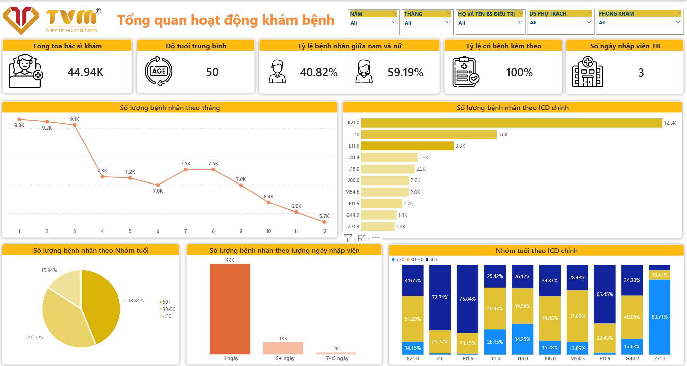
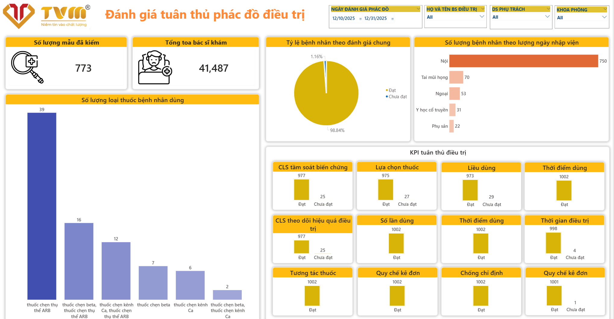
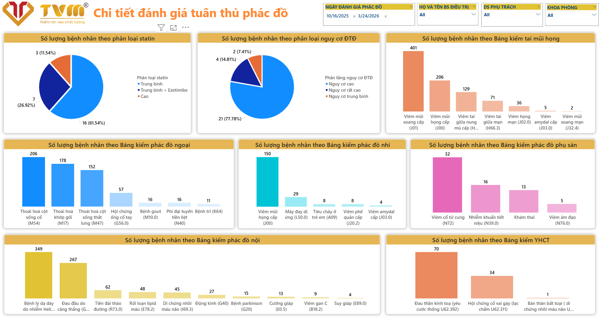

# Medical Treatment Compliance & Patient Analytics Dashboard

## Project Overview

This project focuses on developing an interactive **Power BI Dashboard** for monitoring healthcare operational activities and evaluating treatment protocol compliance.

The dashboard supports hospitals and healthcare organizations in:

- Monitoring patient examination activities
- Evaluating treatment protocol adherence
- Tracking ICD disease distribution
- Analyzing medication usage
- Supporting clinical governance and healthcare decision-making

---

# Project Objectives

The main objectives of this project are:

- Analyze patient examination activities across departments
- Monitor treatment protocol compliance
- Evaluate prescription and medication usage
- Identify disease trends using ICD classification
- Improve healthcare quality management
- Support evidence-based clinical decisions

---

# Technologies Used

| Technology | Purpose |
|---|---|
| Power BI | Dashboard Development |
| DAX | KPI Calculations |
| Power Query | Data Transformation |
| Excel | Healthcare Data Source |
| ICD Classification | Disease Categorization |

---

# Project Structure

```bash
medical-dashboard-project/
│
├── dashboard/
│   └── Medical_Treatment_Dashboard.pbix
│
├── dataset/
│   └── healthcare_data.xlsx
│
├── images/
│   ├── overall_medical_dashboard.png
│   ├── treatment_compliance_dashboard.png
│   └── detailed_treatment_dashboard.png
│
└── README.md
```

---

# Dashboard Pages

---

# Overall Medical Examination Dashboard

## Dashboard Preview



---

##  Description

This dashboard provides an overview of hospital examination activities and patient demographics.

---

## Main KPIs

| KPI | Description |
|---|---|
| Total Patient Examinations | Total number of examined patients |
| Average Patient Age | Average age of patients |
| Male/Female Ratio | Gender distribution |
| Comorbidity Rate | Percentage of patients with comorbidities |
| Average Hospitalization Days | Average length of hospital stay |

---

## Main Visualizations

### Monthly Patient Trend
- Displays patient volume by month
- Helps identify healthcare demand trends

### ICD Disease Distribution
- Shows the most common ICD diagnosis codes
- Supports disease monitoring and analysis

### Age Group Analysis
Patient groups:
- Under 30
- 30–50
- Over 50

### Hospitalization Duration Analysis
Analyzes hospitalization periods:
- 1 day
- 7–15 days
- 15+ days

### ICD Distribution by Age Group
Compares disease distribution across age categories.

---

## Key Insights

- Most patients are over 50 years old
- Female patients account for the majority
- K21.0 and I10 are the most common ICD diagnoses
- Most hospital stays are short-term

---

# Treatment Compliance Dashboard

## Dashboard Preview



---

## Description

This dashboard evaluates treatment protocol compliance according to clinical guidelines and hospital regulations.

---

## Main KPIs

| KPI | Description |
|---|---|
| Evaluated Samples | Number of evaluated medical records |
| Total Doctors | Total participating doctors |
| Compliance Rate | Overall treatment compliance percentage |

---

## Compliance Evaluation Categories

### Drug Selection
Evaluates whether medications follow treatment protocols.

### Dosage Accuracy
Checks dosage appropriateness.

### Medication Timing
Evaluates timing compliance for medication usage.

### Drug Interaction
Monitors harmful drug interactions.

### Prescription Regulation
Evaluates compliance with prescription standards.

### Contraindications
Checks prohibited medication conditions.

### Treatment Duration
Evaluates treatment duration compliance.

### Follow-up Testing
Monitors follow-up and evaluation procedures.

---

## Additional Analysis

### Medication Usage Analysis
- Number of medication combinations used
- Most frequently prescribed medications

### Department-Level Compliance
Departments included:
- Internal Medicine
- Surgery
- ENT
- Obstetrics
- Traditional Medicine

---

## Key Insights

- Overall compliance exceeds 98%
- Prescription regulation adherence is extremely high
- Internal medicine has the highest evaluated patient volume

---

# Detailed Treatment Protocol Dashboard

## Dashboard Preview



---

## Description

This dashboard provides detailed protocol evaluation by department and disease category.

---

## Main Analysis Areas

### Statin Classification
Analyzes:
- Moderate-intensity statin therapy
- High-intensity statin therapy
- Combination therapy

### Cardiovascular Risk Classification
Patient categories:
- High risk
- Very high risk
- Moderate risk

### Department-Level Disease Analysis
Departments analyzed:
- Internal Medicine
- Surgery
- Pediatrics
- ENT
- Obstetrics
- Traditional Medicine

---

## Department Insights

### Internal Medicine
Common diseases:
- Gastritis
- Hypertension
- Diabetes
- Lipid disorders

### ENT Department
Common diseases:
- Sinusitis
- Pharyngitis
- Tonsillitis

### Obstetrics Department
Common diseases:
- Cervical inflammation
- Urinary tract infection
- Vaginitis

---

## Key Insights

- Internal medicine dominates patient volume
- High cardiovascular risk patients account for the majority
- ENT department mainly handles respiratory infections
- Obstetrics focuses on gynecological inflammatory diseases

---

# Example KPIs
## Patient KPIs
- Total Patients
- Average Age
- Gender Ratio
- Average Length of Stay

## Compliance KPIs
- Treatment Compliance Rate
- Prescription Accuracy
- Drug Interaction Detection Rate
- Contraindication Monitoring Rate

---

# Business Value

This dashboard helps healthcare organizations:

- Improve treatment quality
- Monitor clinical compliance
- Support evidence-based treatment decisions
- Identify high-risk disease groups
- Optimize healthcare operations
- Enhance healthcare governance

---

